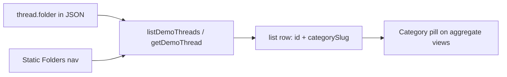

# Centurion demo: single folder primitive (replaces prior chips/$raw plan)

## Drop previous plan

The earlier “`$raw.centurionFolder` + pills + sanitize labels” plan is **superseded**. Same user goals, cleaner model: **one primitive, one pipeline, no label-tree duplicate.**

---

## Are we using the folders primitive properly?

**Mostly in data + routing; not in list/UI.**

| Layer | Today | Proper? |
|--------|--------|--------|
| **Corpus `thread.folder`** | Required enum: internal, individual, group, travel-agents, spam. Adapter filters list by it. | **Yes** — this is the real “where does this thread live in Centurion” primitive. |
| **URL `/mail/:folder`** | Same param for Gmail-style folders (inbox, sent) and Centurion slices (internal, …). Normalized via `normalizeDemoMailFolderSlug`. | **OK** — one router knob; slightly overloaded naming but workable. |
| **Thread list rows** | `{ id, historyId }` only. No category on row. | **No** — category exists on thread but **never reaches list**. UI fell back to **labels** (billing/notification) to show “kind of mail” in inbox. That’s the wrong primitive for category. |
| **Second sidebar (“Folders” + `SidebarLabels`)** | Non-Google heading + `userLabels` from demo local store / corpus-derived labels. | **No** — duplicates navigation already expressed by **static Folders** + `thread.folder`. Two channels for one concept. Persisted store keeps ghosts (billing/notification) forever. |

**Conclusion:** `thread.folder` is the right primitive; problem is **not threading it through list + dropping the fake label sidebar**, not weak enum design.

---

## Target architecture (elegant)

**Rule:** Centurion **category** = `thread.folder` only. Do not encode category as user labels in corpus for sidebar or row chrome (billing/notification stay removed).

1. **List DTO** — Add an explicit optional field on each thread object (prefer **typed** `centurionCategory` or `mailCategory` over `unknown` `$raw`): same union as category folders (`internal` | `individual` | `group` | `travel-agents`), omit for spam rows if they never appear in inbox list. Align with existing [`IGetThreadsResponse`](apps/server/src/lib/driver/types.ts) by extending the thread object shape (optional field; live API leaves it undefined).

2. **Detail DTO** — Optional same field on [`IGetThreadResponse`](apps/server/src/lib/driver/types.ts) (optional in zod) so headers can show category without inferring from messages. Demo adapter sets it; production ignores.

3. **UI — row** — Small `CategoryPill`: label text from [`DEMO_MAIL_FOLDER_DEFINITIONS`](apps/mail/lib/demo/folder-map.ts) `title`. **Visibility:** show on aggregate routes (inbox, urgent, sent, archive, bin, …); **hide** when current route is a Centurion category folder **and** `thread.folder === route` (no redundant “Internal Mail” on every row in `/mail/internal`). Clicks: `Link` to `/mail/{folder}`.

4. **UI — sidebar** — If `isFrontendOnlyDemo()`, **do not render** the [`NavMain`](apps/mail/components/ui/nav-main.tsx) block that wraps `SidebarLabels` (~248–274). Static **Folders** section in [`navigation.ts`](apps/mail/config/navigation.ts) is the only folder navigation for demo.

5. **Persistence** — [`sanitizeLabels`](apps/mail/lib/demo/local-store.ts): remove entries whose name/id matches removed demo tags (`billing`, `notification`, …) same set as [`label-filter.ts`](apps/mail/lib/demo-data/label-filter.ts). Empty → re-seed from [`buildDemoLabels`](apps/mail/lib/demo-data/client.ts) (already filtered). Prevents ghost sidebar rows if user ever re-enables label UI later.

6. **Labels** — Keep `filterRemovedDemoLabels` on thread payloads. Future demo-only tags (e.g. “VIP”) stay **labels**, never copies of `thread.folder`.

---

## Implementation order

1. Extend server thread list/get types with optional category field; demo adapter fills from `thread.folder`.
2. [`ThreadProps.message`](apps/mail/types/index.ts) + [`mail-list.tsx`](apps/mail/components/mail/mail-list.tsx) pill + route gating.
3. Optional: [`mail-display.tsx`](apps/mail/components/mail/mail-display.tsx) same pill near header.
4. `nav-main`: hide `SidebarLabels` when frontend-only demo.
5. `sanitizeLabels` strip removed names + tests ([`demo-data.adapter.test.ts`](apps/mail/tests/demo-data.adapter.test.ts), vitest run).

---

## Out of scope (deliberate)

- Renaming URL param or splitting Centurion routes from Gmail routes (big router churn; low payoff).
- Re-adding billing/notification as **labels**; user-facing category is **folder** + pill only.
