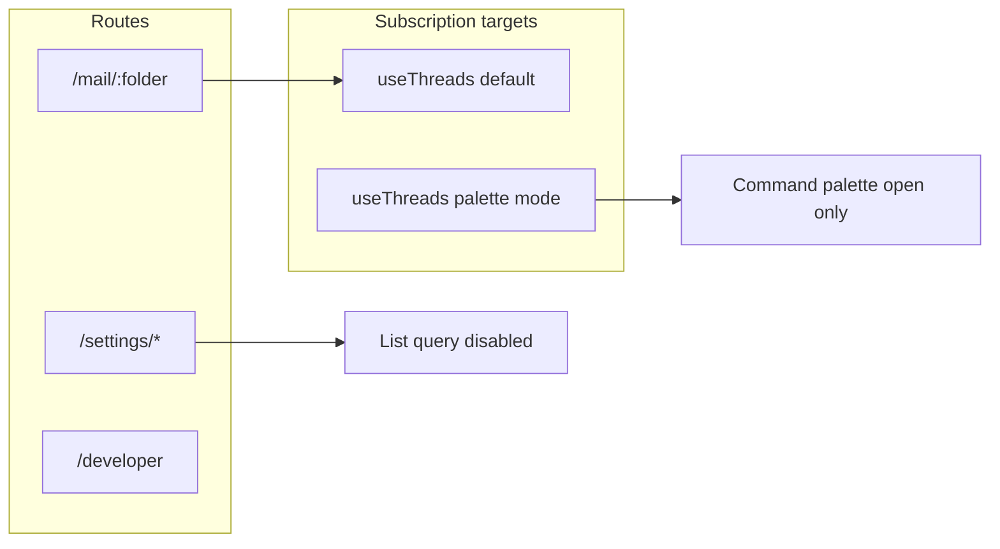

# Mail FE Navigation Performance Implementation Plan

> **For agentic workers:** REQUIRED SUB-SKILL: Use superpowers:subagent-driven-development (recommended) or superpowers:executing-plans to implement this plan task-by-task. Steps use checkbox (`- [ ]`) syntax for tracking.

**Goal:** Make the mail app feel fast on first load and when moving between routes by removing unnecessary thread-list work off mail folder routes, avoiding redundant session round-trips inside the `/mail/*` subtree, and cutting avoidable rerenders and artificial delays.

**Architecture:** Add a tiny pure helper `computeThreadListEnabled` so default list subscription rules are unit-tested. Extend `useThreads` with an optional **command-palette mode** (only subscribe when the palette is open; use `folder ?? 'inbox'` for query key). Hoist session enforcement to the mail layout `clientLoader` and remove duplicate `getSession` calls from leaf mail routes. Tune `refetchOnMount` on the thread infinite queries. Fix `mail-list` callback deps and remove hot-path `console.log` calls.

**Tech Stack:** React Router 7 (`clientLoader`), TanStack Query v5, tRPC client, Vitest.

---

## Zero-context engineer primer

- **Repository root:** The git root is the monorepo (the folder that contains `apps/mail`). All `pnpm` commands below run from that root unless noted.
- **Package:** Mail app is `apps/mail`, npm name `@zero/mail`.
- **Tests:** `pnpm --filter=@zero/mail run test:demo` runs Vitest on `apps/mail/tests`.
- **Lint:** `pnpm --filter=@zero/mail run lint`.
- **Path alias:** Code under `apps/mail` imports with `@/` → `apps/mail/` (see local tsconfig).
- **Do not confuse with Next.js App Router:** This app uses **React Router 7** file-based routes; route modules export `clientLoader`, not Next.js APIs.
- **Env:** Session redirects and absolute URLs use `import.meta.env.VITE_PUBLIC_APP_URL`. Do not hardcode origins.

---

## Handoff: read this first (no-repo-context LLM)

You are implementing a **performance and navigation** change set in **`apps/mail` only**. Do **not** edit other workspace packages unless a command fails for an obvious repo-level reason.

**Execute tasks in order: Task 1 → Task 6.** Each task ends with a **git commit** as written (or one combined commit if the user prefers, but separate commits ease bisect).

**If `rg` is not installed:** from repo root run `grep -R "useThreads(" apps/mail --include="*.tsx" --include="*.ts"` instead of the `rg` command below.

**Out of scope (do not do unless asked):**

- Refactor `command-palette-context.tsx` file size or split components (only change the `useThreads` call as specified).
- Change `settings/layout.tsx` auth (mail perf plan does not move settings auth).
- Change [`apps/mail/app/routes.ts`](../../../apps/mail/app/routes.ts) route table.
- Add new dependencies to `package.json`.

**When stuck:**

1. Re-run `pnpm --filter=@zero/mail run lint` and fix **new** errors you introduced.
2. Re-run `pnpm --filter=@zero/mail run test:demo` and read the **first** failure stack trace end-to-end.
3. Compare your `useThreads` body to **Reference: full `useThreads` after Task 2+4** below (whitespace aside, logic should match).

---

## Mandatory pre-flight (do this before Task 2)

Run from repo root:

```bash
rg "useThreads\\(" apps/mail --glob "*.tsx" --glob "*.ts"
```

**Current call sites (baseline; re-verify after edits):**

| Location | Role | After plan: `useThreads()` options |
|----------|------|-------------------------------------|
| [`apps/mail/components/context/command-palette-context.tsx`](../../../apps/mail/components/context/command-palette-context.tsx) | Thread search / commands | **`useThreads({ commandPaletteOpen: open })`** where `open` is from `useQueryState('isCommandPaletteOpen')` |
| [`apps/mail/components/mail/mail-list.tsx`](../../../apps/mail/components/mail/mail-list.tsx) | List + each `Thread` row | **`useThreads()`** default (no args) — twice in file |
| [`apps/mail/components/mail/mail.tsx`](../../../apps/mail/components/mail/mail.tsx) | Mail shell | **`useThreads()`** default |
| [`apps/mail/components/mail/thread-display.tsx`](../../../apps/mail/components/mail/thread-display.tsx) | Thread detail | **`useThreads()`** default |
| [`apps/mail/components/mail/select-all-checkbox.tsx`](../../../apps/mail/components/mail/select-all-checkbox.tsx) | Selection UI | **`useThreads()`** default |
| [`apps/mail/lib/hotkeys/mail-list-hotkeys.tsx`](../../../apps/mail/lib/hotkeys/mail-list-hotkeys.tsx) | List hotkeys | **`useThreads()`** default |
| [`apps/mail/components/context/thread-context.tsx`](../../../apps/mail/components/context/thread-context.tsx) | Thread actions | **`useThreads()`** default |
| [`apps/mail/hooks/driver/use-delete.ts`](../../../apps/mail/hooks/driver/use-delete.ts) | Delete driver | **`useThreads()`** default |
| [`apps/mail/app/(routes)/settings/connections/page.tsx`](../../../apps/mail/app/(routes)/settings/connections/page.tsx) | **Refetch only** after disconnect | **`useThreads()`** default — **see edge case below** |

**Invariant:** Only **command-palette-context.tsx** passes `commandPaletteOpen`. Every other file keeps `useThreads()` with no arguments.

### Edge case: settings / connections + `refetchThreads`

On `/settings/connections`, URL params **do not** include `mail/:folder`, so `useParams().folder` is **`undefined`**.

After Task 2, default `useThreads()` sets `listEnabled = computeThreadListEnabled(..., routeFolder: undefined)` → **`false`**. The infinite query does not auto-run on that page.

**Required behavior:** After disconnect, `refetchThreads()` must still refresh the mailbox list for when the user navigates back to `/mail/...`.

TanStack Query v5: calling **`refetch()`** on a query with `enabled: false` **still runs a fetch** when invoked manually (unlike automatic mount/refetch). No code change is required on the connections page if manual refetch behaves as expected.

**Verification step (Task 2):**

1. Log in (non-demo), open **`/settings/connections`** directly (cold; do not visit mail first).
2. Trigger disconnect (or mock success path in dev if needed).
3. Confirm no unhandled errors from `refetchThreads`.
4. Navigate to `/mail/inbox` and confirm list loads.

If `refetch()` does not run when disabled in your installed Query version, **fallback** in [`connections/page.tsx`](../../../apps/mail/app/(routes)/settings/connections/page.tsx): remove `useThreads` refetch plumbing and after successful disconnect call:

```tsx
import { useQueryClient } from '@tanstack/react-query';

// inside component:
const queryClient = useQueryClient();
const trpc = useTRPC();

// pass into runDisconnectConnection instead of refetchThreads:
void queryClient.invalidateQueries({ queryKey: trpc.mail.listThreads.queryKey() });
```

This matches how other screens invalidate tRPC queries in this repo (e.g. `trpc.templates.list.queryKey()`). Partial `queryKey` invalidation should cover infinite-query variants.

---

## File map

| File | Responsibility |
|------|----------------|
| Create: [`apps/mail/lib/mail/thread-list-query-enabled.ts`](../../../apps/mail/lib/mail/thread-list-query-enabled.ts) | Pure `computeThreadListEnabled`. |
| Create: [`apps/mail/tests/thread-list-query-enabled.test.ts`](../../../apps/mail/tests/thread-list-query-enabled.test.ts) | Unit tests. |
| Modify: [`apps/mail/hooks/use-threads.ts`](../../../apps/mail/hooks/use-threads.ts) | Session + folder gating; palette mode; `refetchOnMount`. |
| Modify: [`apps/mail/components/context/command-palette-context.tsx`](../../../apps/mail/components/context/command-palette-context.tsx) | Pass `commandPaletteOpen` only here. |
| Modify: [`apps/mail/app/(routes)/mail/layout.tsx`](../../../apps/mail/app/(routes)/mail/layout.tsx) | `clientLoader` session gate. |
| Modify: [`apps/mail/app/(routes)/mail/[folder]/page.tsx`](../../../apps/mail/app/(routes)/mail/[folder]/page.tsx) | Remove duplicate session; shorten invalid-folder delay. |
| Modify: [`apps/mail/app/(routes)/mail/compose/page.tsx`](../../../apps/mail/app/(routes)/mail/compose/page.tsx) | Remove duplicate session. |
| Modify: [`apps/mail/app/(routes)/mail/create/page.tsx`](../../../apps/mail/app/(routes)/mail/create/page.tsx) | Remove duplicate session. |
| Modify: [`apps/mail/components/mail/mail-list.tsx`](../../../apps/mail/components/mail/mail-list.tsx) | `autoRead` primitive dep; remove/guard logs. |



---

## Public API to implement

Export `UseThreadsOptions` and `useThreads(options?: UseThreadsOptions)` exactly as in **Reference: full `useThreads` after Task 2 + Task 4** above. The return tuple shape **must stay** `[query, threads, isReachingEnd, loadMore]` so all existing call sites keep working.

**Canonical palette-mode rule (use exactly this):**

```ts
const isPaletteMode = options != null && 'commandPaletteOpen' in options;
```

- `useThreads()` → not palette mode.
- `useThreads({ commandPaletteOpen: open })` from command palette → palette mode, even when `open` is `null`.
- **Never** call `useThreads({ commandPaletteOpen: undefined })`; omit the property instead.

**Only** [`command-palette-context.tsx`](../../../apps/mail/components/context/command-palette-context.tsx) may pass `commandPaletteOpen`. All other call sites use `useThreads()` with no arguments.

---

## Reference: full `useThreads` after Task 2 + Task 4

This is the **intended end state** of the hook (lines through `return [activeThreadsQuery, threads, ...]`). Keep imports at the top of [`use-threads.ts`](../../../apps/mail/hooks/use-threads.ts) as they are today; add:

`import { computeThreadListEnabled } from '@/lib/mail/thread-list-query-enabled';`

Add **exported** type:

```ts
export type UseThreadsOptions = {
  commandPaletteOpen?: string | null;
};
```

Replace the existing `export const useThreads = () => {` block with:

```ts
export const useThreads = (options?: UseThreadsOptions) => {
  const { folder: routeFolder } = useParams<{ folder: string }>();
  const { data: session } = useSession();
  const [searchValue] = useSearchValue();
  const [backgroundQueue] = useAtom(backgroundQueueAtom);
  const isInQueue = useAtomValue(isThreadInBackgroundQueueAtom);
  const trpc = useTRPC();
  const { labels } = useSearchLabels();
  const demoMode = isFrontendOnlyDemo();

  const isPaletteMode = options != null && 'commandPaletteOpen' in options;
  const paletteOpen = options?.commandPaletteOpen === 'true';
  const folderForQuery = isPaletteMode ? (routeFolder ?? 'inbox') : routeFolder;
  const demoContext = resolveDemoThreadQueryContext(folderForQuery);

  const listEnabled = isPaletteMode
    ? paletteOpen
    : computeThreadListEnabled({
        demoMode,
        sessionUserId: session?.user?.id,
        routeFolder,
      });

  const demoThreadsQuery = useInfiniteQuery({
    queryKey: [
      'demo',
      'mail',
      'listThreads',
      demoContext.folder,
      demoContext.workQueue,
      searchValue.value,
      labels.join(','),
    ],
    initialPageParam: '',
    queryFn: async ({ pageParam }) =>
      listDemoThreads({
        folder: demoContext.folder,
        workQueue: demoContext.workQueue ?? undefined,
        q: searchValue.value,
        labelIds: labels,
        cursor: typeof pageParam === 'string' ? pageParam : '',
      }),
    getNextPageParam: (lastPage) => lastPage?.nextPageToken ?? null,
    staleTime: 60 * 1000,
    refetchOnMount: false,
    refetchIntervalInBackground: true,
    enabled: demoMode && listEnabled,
  });

  const threadsQuery = useInfiniteQuery(
    trpc.mail.listThreads.infiniteQueryOptions(
      {
        q: searchValue.value,
        folder: folderForQuery,
        labelIds: labels,
      },
      {
        initialCursor: '',
        getNextPageParam: (lastPage) => lastPage?.nextPageToken ?? null,
        enabled: !demoMode && listEnabled,
        staleTime: 60 * 1000,
        refetchOnMount: false,
        refetchIntervalInBackground: true,
      },
    ),
  );
  const activeThreadsQuery = demoMode ? demoThreadsQuery : threadsQuery;

  const threads = useMemo(() => {
    return activeThreadsQuery.data
      ? activeThreadsQuery.data.pages
          .flatMap((e) => e.threads)
          .filter(Boolean)
          .filter((e) => !isInQueue(`thread:${e.id}`))
      : [];
  }, [activeThreadsQuery.data, activeThreadsQuery.dataUpdatedAt, isInQueue, backgroundQueue]);

  const isEmpty = useMemo(() => threads.length === 0, [threads]);
  const isReachingEnd =
    isEmpty ||
    (activeThreadsQuery.data &&
      !activeThreadsQuery.data.pages[activeThreadsQuery.data.pages.length - 1]?.nextPageToken);

  const loadMore = async () => {
    if (activeThreadsQuery.isLoading || activeThreadsQuery.isFetching) return;
    await activeThreadsQuery.fetchNextPage();
  };

  return [activeThreadsQuery, threads, isReachingEnd, loadMore] as const;
};
```

**Do not** change `useThread` or code below it unless TypeScript errors force an import cleanup.

---

### Task 1: Pure thread-list enable policy + tests

**Files:**

- Create: [`apps/mail/lib/mail/thread-list-query-enabled.ts`](../../../apps/mail/lib/mail/thread-list-query-enabled.ts)
- Create: [`apps/mail/tests/thread-list-query-enabled.test.ts`](../../../apps/mail/tests/thread-list-query-enabled.test.ts)

- [ ] **Step 1: Write the failing test** (full file)

```ts
import { describe, expect, it } from 'vitest';
import { computeThreadListEnabled } from '../lib/mail/thread-list-query-enabled';

describe('computeThreadListEnabled', () => {
  it('returns false when route folder is missing', () => {
    expect(
      computeThreadListEnabled({
        demoMode: true,
        sessionUserId: undefined,
        routeFolder: undefined,
      }),
    ).toBe(false);
    expect(
      computeThreadListEnabled({
        demoMode: false,
        sessionUserId: 'user-1',
        routeFolder: undefined,
      }),
    ).toBe(false);
  });

  it('returns true in demo mode when folder is present', () => {
    expect(
      computeThreadListEnabled({
        demoMode: true,
        sessionUserId: undefined,
        routeFolder: 'inbox',
      }),
    ).toBe(true);
  });

  it('returns false in live mode without session', () => {
    expect(
      computeThreadListEnabled({
        demoMode: false,
        sessionUserId: undefined,
        routeFolder: 'inbox',
      }),
    ).toBe(false);
  });

  it('returns true in live mode with session and folder', () => {
    expect(
      computeThreadListEnabled({
        demoMode: false,
        sessionUserId: 'user-1',
        routeFolder: 'inbox',
      }),
    ).toBe(true);
  });
});
```

- [ ] **Step 2: Run test to verify failure**

Run: `pnpm --filter=@zero/mail run test:demo -- tests/thread-list-query-enabled.test.ts`  
Expected: FAIL (cannot resolve module or export).

- [ ] **Step 3: Minimal implementation** (full file)

```ts
export function computeThreadListEnabled(input: {
  demoMode: boolean;
  sessionUserId: string | undefined;
  routeFolder: string | undefined;
}): boolean {
  const hasFolder = typeof input.routeFolder === 'string' && input.routeFolder.length > 0;
  if (!hasFolder) return false;
  if (input.demoMode) return true;
  return Boolean(input.sessionUserId);
}
```

- [ ] **Step 4: Run test to verify pass**

Run: `pnpm --filter=@zero/mail run test:demo -- tests/thread-list-query-enabled.test.ts`  
Expected: PASS.

- [ ] **Step 5: Commit**

```bash
git add apps/mail/lib/mail/thread-list-query-enabled.ts apps/mail/tests/thread-list-query-enabled.test.ts
git commit -m "feat(mail): add testable thread list query enable policy"
```

---

### Task 2: Wire `useThreads` + command palette

**Files:**

- Modify: [`apps/mail/hooks/use-threads.ts`](../../../apps/mail/hooks/use-threads.ts)
- Modify: [`apps/mail/components/context/command-palette-context.tsx`](../../../apps/mail/components/context/command-palette-context.tsx)

**Implementation checklist (follow in order):**

1. Add `import { computeThreadListEnabled } from '@/lib/mail/thread-list-query-enabled';`
2. At top of `useThreads`, add `const { data: session } = useSession();` (`useSession` is already imported in this file).
3. `const routeFolder = useParams<{ folder: string }>().folder;`
4. **Palette branch:** if `options?.commandPaletteOpen !== undefined`:
   - `const paletteOpen = options.commandPaletteOpen === 'true';`
   - `const folderForQuery = routeFolder ?? 'inbox';`
   - `const demoContext = resolveDemoThreadQueryContext(folderForQuery);`
   - `const listEnabled = paletteOpen;`
5. **Default branch:** else:
   - `const folderForQuery = routeFolder;`
   - `const demoContext = resolveDemoThreadQueryContext(folderForQuery);`  
     (When `listEnabled` is false, query is disabled; `resolveDemoThreadQueryContext(undefined)` is still safe but unused for network — keeping one code path avoids drift.)
   - `const listEnabled = computeThreadListEnabled({ demoMode, sessionUserId: session?.user?.id, routeFolder });`
6. **Demo infinite query** `enabled:` must be `demoMode && listEnabled` (replace `enabled: demoMode`).
7. **Live infinite query** inside `infiniteQueryOptions` third argument: set `enabled: !demoMode && listEnabled` (replace `enabled: !demoMode`).
8. **Live query input object:** pass `folder: folderForQuery` (not raw `folder` if you renamed) so tRPC always receives the same folder as `demoContext` when both run conceptually in palette mode.
9. In **command-palette-context.tsx**, change:

```ts
const [, threads] = useThreads();
```

to:

```ts
const [, threads] = useThreads({ commandPaletteOpen: open });
```

where `open` is the first tuple element from `useQueryState('isCommandPaletteOpen')`.

- [ ] **Step 1: Run unit tests**

Run: `pnpm --filter=@zero/mail run test:demo -- tests/thread-list-query-enabled.test.ts`  
Expected: PASS.

- [ ] **Step 2: Run lint**

Run: `pnpm --filter=@zero/mail run lint`  
Expected: PASS (or only pre-existing issues; do not introduce new errors).

- [ ] **Step 3: Manual regression**

- Open app, go to `/mail/inbox`, confirm list loads (demo and live as applicable).
- Open command palette (shortcut as configured), confirm thread-related commands still see data after opening once.
- Open `/settings/general`, confirm no obvious errors in console.
- Run **connections refetch** verification from “Edge case” section above.

- [ ] **Step 4: Commit**

```bash
git add apps/mail/hooks/use-threads.ts apps/mail/components/context/command-palette-context.tsx
git commit -m "perf(mail): gate thread list query by route and palette open state"
```

---

### Task 3: Hoist `/mail` subtree session check to mail layout

**Files:**

- Modify: [`apps/mail/app/(routes)/mail/layout.tsx`](../../../apps/mail/app/(routes)/mail/layout.tsx)
- Modify: [`apps/mail/app/(routes)/mail/[folder]/page.tsx`](../../../apps/mail/app/(routes)/mail/[folder]/page.tsx)
- Modify: [`apps/mail/app/(routes)/mail/compose/page.tsx`](../../../apps/mail/app/(routes)/mail/compose/page.tsx)
- Modify: [`apps/mail/app/(routes)/mail/create/page.tsx`](../../../apps/mail/app/(routes)/mail/create/page.tsx)

- [ ] **Step 1: Add to mail `layout.tsx`** (keep existing imports; add these)

```tsx
import { authProxy } from '@/lib/auth-proxy';
import type { Route } from './+types/layout';

export async function clientLoader({ request }: Route.ClientLoaderArgs) {
  const session = await authProxy.api.getSession({ headers: request.headers });
  if (!session) {
    return Response.redirect(`${import.meta.env.VITE_PUBLIC_APP_URL}/login`);
  }
  return null;
}
```

If `./+types/layout` is missing, run `pnpm --filter=@zero/mail run build` or start dev once so React Router generates types.

- [ ] **Step 2: `[folder]/page.tsx` loader** — final shape:

```ts
export async function clientLoader({ params }: Route.ClientLoaderArgs) {
  if (!params.folder) return Response.redirect(`${import.meta.env.VITE_PUBLIC_APP_URL}/mail/inbox`);

  return {
    folder: params.folder,
  };
}
```

Remove `authProxy` import and any `getSession` usage from this file. Drop `request` from the destructuring if unused so ESLint does not warn.

- [ ] **Step 3: `compose/page.tsx`** — remove session check and `authProxy` import; keep everything from `const url = new URL(request.url)` onward.

- [ ] **Step 4: `create/page.tsx`** — remove session check and `authProxy` import; keep redirect logic.

- [ ] **Step 5: Verify**

Run: `pnpm --filter=@zero/mail run lint`  
Manual: logged-out user hitting `/mail/inbox` → redirect login; logged-in user → mail works.

- [ ] **Step 6: Commit**

```bash
git add apps/mail/app/(routes)/mail/layout.tsx apps/mail/app/(routes)/mail/[folder]/page.tsx apps/mail/app/(routes)/mail/compose/page.tsx apps/mail/app/(routes)/mail/create/page.tsx
git commit -m "perf(mail): dedupe session clientLoader to mail layout"
```

---

### Task 4: `refetchOnMount` for thread list

**Files:**

- Modify: [`apps/mail/hooks/use-threads.ts`](../../../apps/mail/hooks/use-threads.ts)

- [ ] **Step 1:** On **both** infinite queries (demo + live), set `refetchOnMount: false`. Keep `staleTime: 60 * 1000` and `refetchIntervalInBackground` as they are unless product requires changing them.

- [ ] **Step 2:** Run full demo tests:

`pnpm --filter=@zero/mail run test:demo`  
Expected: PASS.

- [ ] **Step 3: Commit**

```bash
git add apps/mail/hooks/use-threads.ts
git commit -m "perf(mail): avoid redundant thread list refetch on mount"
```

---

### Task 5: Mail list click handler + logs

**Files:**

- Modify: [`apps/mail/components/mail/mail-list.tsx`](../../../apps/mail/components/mail/mail-list.tsx)

- [ ] **Step 1:** After `useSettings()`, add:

```ts
const autoReadEnabled = settingsData?.settings?.autoRead ?? true;
```

Use `autoReadEnabled` inside `handleMailClick` instead of `settingsData?.settings?.autoRead ?? true`.

- [ ] **Step 2:** In `handleMailClick` `useCallback` dependency array, replace `settingsData` with `autoReadEnabled`.

- [ ] **Step 3:** Remove or guard all `console.log` calls in `getSelectMode`, `handleSelectMail`, and `handleMailClick` (run `grep -n "console.log" apps/mail/components/mail/mail-list.tsx` from repo root). Preferred: delete. Acceptable: `if (import.meta.env.DEV) { console.log(...) }`. Line numbers drift; always search, do not assume fixed lines.

- [ ] **Step 4:** Run:

`pnpm --filter=@zero/mail run test:demo -- tests/demo-mail-list-perf-guards.test.ts`  
Expected: PASS.

- [ ] **Step 5: Commit**

```bash
git add apps/mail/components/mail/mail-list.tsx
git commit -m "perf(mail): stabilize mail row click handler and trim hot logs"
```

---

### Task 6: Invalid custom-folder redirect delay

**Files:**

- Modify: [`apps/mail/app/(routes)/mail/[folder]/page.tsx`](../../../apps/mail/app/(routes)/mail/[folder]/page.tsx)

- [ ] **Step 1:** Change `setTimeout(..., 2000)` to `300` (or `0` if product accepts instant redirect).

- [ ] **Step 2: Commit**

```bash
git add apps/mail/app/(routes)/mail/[folder]/page.tsx
git commit -m "fix(mail): shorten invalid folder redirect delay"
```

---

## Definition of done (full regression)

- [ ] `pnpm --filter=@zero/mail run test:demo` — PASS  
- [ ] `pnpm --filter=@zero/mail run lint` — PASS or pre-existing only  
- [ ] Cold load `/mail/inbox` (demo + live if both exist) — list appears  
- [ ] Navigate `/mail/inbox` → `/settings/general` → back — no console errors  
- [ ] Command palette: closed — no thread list network for palette-only path; open — search still works  
- [ ] `/settings/connections` disconnect flow + navigate to inbox — list consistent  
- [ ] Invalid label folder URL — still redirects to inbox, faster than before  

---

## Optional follow-ups (do not block this plan)

- Gate [`useLabels`](../../../apps/mail/hooks/use-labels.ts) in command palette when closed (palette-only).
- Remove per-row `useThreads()` inside `Thread` in [`mail-list.tsx`](../../../apps/mail/components/mail/mail-list.tsx) if profiling shows benefit (pass data from parent).

---

## Troubleshooting

| Symptom | Likely cause | What to do |
|--------|----------------|------------|
| TypeScript: cannot find module `./+types/layout` | React Router has not generated types for [`mail/layout.tsx`](../../../apps/mail/app/(routes)/mail/layout.tsx) yet | Run `pnpm --filter=@zero/mail run build` or `pnpm --filter=@zero/mail run dev` once from repo root, then re-run `pnpm --filter=@zero/mail run lint`. |
| Command palette shows no threads after change | `useThreads` not in palette mode or `open` never equals `'true'` | Confirm only nuqs string `'true'` opens the query (`commandPaletteOpen === 'true'`). Find `useQueryState('isCommandPaletteOpen')` in [`command-palette-context.tsx`](../../../apps/mail/components/context/command-palette-context.tsx) and pass that first tuple value into `useThreads({ commandPaletteOpen: open })`. |
| Mail list empty on `/mail/inbox` | `listEnabled` false (session or folder wrong) | Live: ensure `session?.user?.id` exists. Folder param must be non-empty string from `:folder` route. |
| ESLint: hooks order / conditional hooks | Added early `return` before hooks inside a component | Hooks must run unconditionally at top level; fix the component, not `useThreads`. |
| Tests pass but UI list never updates after tab switch | Expected with `refetchOnMount: false` until stale | Use existing `refreshMailList` event or navigate; if product requires always-fresh on focus, revisit Task 4 (not part of this plan). |
| `pnpm --filter=@zero/mail` fails | Wrong working directory | `cd` to monorepo root (directory containing `apps/` and `pnpm-workspace.yaml`). |

---

## Self-review

- **Spec coverage:** Gating, palette mode, auth dedupe, refetch policy, mail-list stability, folder delay — each has a task.  
- **Placeholder scan:** No TBD/TODO.  
- **Type consistency:** `UseThreadsOptions.commandPaletteOpen` matches nuqs `string | null`.  
- **Weaker-LLM gaps closed:** Repo root, `rg` inventory, connections refetch edge case, full `useThreads` reference, invalidate fallback snippet, troubleshooting table, out-of-scope list.

---

## Execution handoff

**This document is ready to paste into another LLM** with instruction: “Implement every task in order inside `apps/mail`; use the reference `useThreads` block verbatim unless TypeScript forces trivial edits.”

Optional for humans: subagent-driven vs inline execution (`subagent-driven-development` / `executing-plans` skills) — not required for an external model.

**Done:** Plan finalized for zero-context handoff as of this revision.
