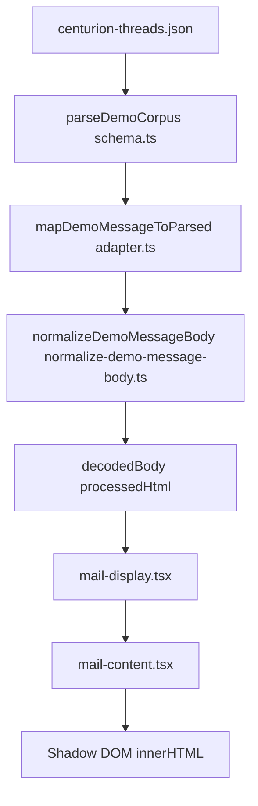

# Demo Rich HTML Received Emails Implementation Plan

> **For agentic workers:** REQUIRED SUB-SKILL: Use superpowers:subagent-driven-development (recommended) or superpowers:executing-plans to implement this plan task-by-task. Steps use checkbox (`- [ ]`) syntax for tracking.

**Goal:** Add oldest-priority demo threads whose bodies are real HTML (matching Tiptap/novel output patterns) so inbox UI proves received-mail rendering for highlight, text color, and other default extensions—without guessing markup via regex.

**Architecture:** Extend the demo corpus schema with an explicit `bodyFormat` (`text` | `html`, default `text`) so existing plain fixtures stay unchanged and new rows opt into HTML. Move body normalization into a tiny pure module (`normalize-demo-message-body.ts`) used only by the demo adapter: plain path keeps today’s escaped paragraph behavior; HTML path strips scripts and passes through markup for `decodedBody` / `processedHtml`. Demo mode still skips `trpc.mail.processEmailContent` ([`apps/mail/components/mail/mail-content.tsx`](apps/mail/components/mail/mail-content.tsx)); this plan intentionally validates the **demo + shadow DOM** path first.

**Tech Stack:** Zod demo schema ([`apps/mail/lib/demo-data/schema.ts`](apps/mail/lib/demo-data/schema.ts)), demo adapter ([`apps/mail/lib/demo-data/adapter.ts`](apps/mail/lib/demo-data/adapter.ts)), Vitest ([`apps/mail/tests/`](apps/mail/tests/)), fixture JSON ([`apps/mail/lib/demo-data/centurion-threads.json`](apps/mail/lib/demo-data/centurion-threads.json)).

---



### Task 1: Schema + type for explicit body format

**Files:**

- Modify: [`apps/mail/lib/demo-data/schema.ts`](apps/mail/lib/demo-data/schema.ts)

- [ ] **Step 1: Extend `demoMessageSchema`**

Add optional field with default so every existing message stays valid without JSON edits:

```typescript
bodyFormat: z.enum(['text', 'html']).default('text'),
```

Full shape (show only the changed parts):

```typescript
export const demoMessageSchema = z.object({
  id: z.string().min(1),
  sender: participantSchema,
  to: z.array(participantSchema).min(1),
  cc: z.array(participantSchema).optional(),
  bcc: z.array(participantSchema).optional(),
  subject: z.string(),
  body: z.string(),
  bodyFormat: z.enum(['text', 'html']).default('text'),
  receivedOn: z.string().min(1),
  unread: z.boolean(),
  isDraft: z.boolean().optional(),
});
```

- [ ] **Step 2: Run TypeScript check on mail app**

Run: `pnpm exec tsc -p apps/mail --noEmit` (or repo’s equivalent `turbo`/`pnpm` script if defined).

Expected: PASS (no new errors from `DemoMessage` inference).

---

### Task 2: Pure normalizer module (elegant core)

**Files:**

- Create: [`apps/mail/lib/demo-data/normalize-demo-message-body.ts`](apps/mail/lib/demo-data/normalize-demo-message-body.ts)
- Modify: [`apps/mail/lib/demo-data/adapter.ts`](apps/mail/lib/demo-data/adapter.ts)

- [ ] **Step 1: Write failing tests first**

Create: [`apps/mail/tests/normalize-demo-message-body.test.ts`](apps/mail/tests/normalize-demo-message-body.test.ts)

```typescript
import { describe, expect, it } from 'vitest';
import { normalizeDemoMessageBody } from '../lib/demo-data/normalize-demo-message-body';

describe('normalizeDemoMessageBody', () => {
  it('converts plain text to paragraph html', () => {
    const out = normalizeDemoMessageBody({
      body: 'Hello\nWorld',
      bodyFormat: 'text',
    });
    expect(out).toBe('<p>Hello</p><p>World</p>');
  });

  it('preserves html bodies and strips scripts', () => {
    const html =
      '<p><strong>Thank you</strong> <mark style="background-color:#fef08a">done</mark></p><script>alert(1)</script>';
    const out = normalizeDemoMessageBody({
      body: html,
      bodyFormat: 'html',
    });
    expect(out).toContain('<mark');
    expect(out).not.toContain('<script');
  });

  it('does not treat math-looking text as html when format is text', () => {
    const out = normalizeDemoMessageBody({
      body: 'If rate < 5 then escalate',
      bodyFormat: 'text',
    });
    expect(out).toContain('&lt;');
  });
});
```

Run: `pnpm vitest run apps/mail/tests/normalize-demo-message-body.test.ts`

Expected: FAIL (module missing or export missing).

- [ ] **Step 2: Implement `normalize-demo-message-body.ts`**

```typescript
const SCRIPT_TAG_REGEX = /<script\b[^<]*(?:(?!<\/script>)<[^<]*)*<\/script>/gi;

const escapeHtml = (value: string): string =>
  value
    .replaceAll('&', '&amp;')
    .replaceAll('<', '&lt;')
    .replaceAll('>', '&gt;');

export function normalizeDemoMessageBody(input: {
  body: string;
  bodyFormat: 'text' | 'html';
}): string {
  const normalized = input.body.trim();
  if (!normalized) return '';

  if (input.bodyFormat === 'html') {
    return normalized.replace(SCRIPT_TAG_REGEX, '').trim();
  }

  const safe = escapeHtml(normalized);
  return safe
    .split('\n')
    .map((line) => line.trim())
    .filter((line) => line.length > 0)
    .map((line) => `<p>${line}</p>`)
    .join('');
}
```

- [ ] **Step 3: Wire adapter**

In [`apps/mail/lib/demo-data/adapter.ts`](apps/mail/lib/demo-data/adapter.ts), replace inline `toHtml(message.body)` with:

```typescript
import { normalizeDemoMessageBody } from './normalize-demo-message-body';

// inside mapDemoMessageToParsed:
const htmlBody = normalizeDemoMessageBody({
  body: message.body,
  bodyFormat: message.bodyFormat,
});
```

Use `htmlBody` for both `processedHtml` and `decodedBody` (same as today’s `toHtml` output).

Remove the old private `toHtml` function from this file.

Run: `pnpm vitest run apps/mail/tests/normalize-demo-message-body.test.ts`

Expected: PASS.

- [ ] **Step 4: Commit**

```bash
git add apps/mail/lib/demo-data/schema.ts apps/mail/lib/demo-data/normalize-demo-message-body.ts apps/mail/lib/demo-data/adapter.ts apps/mail/tests/normalize-demo-message-body.test.ts
git commit -m "feat(demo): explicit bodyFormat + normalize demo HTML bodies"
```

---

### Task 3: Oldest threads + full editor-shaped HTML fixtures

**Files:**

- Modify: [`apps/mail/lib/demo-data/centurion-threads.json`](apps/mail/lib/demo-data/centurion-threads.json)

- [ ] **Step 1: Pick timestamps**

Use `receivedOn` strictly older than current corpus minimum (`2026-04-04T09:30:00.000Z` from spam-002), e.g. `2026-03-10T08:00:00.000Z`, `2026-03-09T08:00:00.000Z`, `2026-03-08T08:00:00.000Z` so inbox sort puts them at bottom.

- [ ] **Step 2: Add ≥3 threads**

Each thread: one inbound message, `"bodyFormat": "html"`, realistic hotel ops copy, distinct subject prefix like `[Demo rich]` for search.

Coverage spread across threads (not one giant blob):

| Thread | Folder (existing enum) | Extra |
|--------|----------------------|--------|
| A | `internal` | Headings H1–H3, bold/italic/underline/strike, blockquote, link `<a href="https://example.com">` |
| B | `individual` | Bullet + ordered lists, colored `<span style="color:#...">`, `<mark style="background-color:...">` |
| C | `travel-agents` | Mix + `cc` array on message |

Example minimal JSON shape (repeat with different ids/subjects/bodies):

```json
{
  "id": "sa-thread-rich-001",
  "folder": "internal",
  "urgent": false,
  "labels": [],
  "messages": [
    {
      "id": "sa-rich-001-msg-01",
      "sender": { "name": "Lerato Mokoena", "email": "lerato.mokoena@legacyhotels.co.za" },
      "to": [{ "name": "Centurion Hotel Reservations", "email": "centurion@legacyhotels.co.za" }],
      "subject": "[Demo rich] Internal: formatting smoke test",
      "bodyFormat": "html",
      "body": "<h2>Handover</h2><p>Please review <strong>bold</strong>, <em>italic</em>, <u>underline</u>, <s>struck</s>.</p><blockquote>Quote block.</blockquote><p><a href=\"https://example.com\" target=\"_blank\" rel=\"noopener noreferrer\">Policy link</a></p>",
      "receivedOn": "2026-03-10T08:00:00.000Z",
      "unread": true
    }
  ]
}
```

- [ ] **Step 3: Optional fidelity pass**

Compose one message in app editor with all marks, call `getHTML()`, paste into one fixture body so HTML matches real Tiptap output (colors, mark tags).

- [ ] **Step 4: Validate corpus**

Run a one-off parse in Node or rely on app boot: `parseDemoCorpus` must accept file (thread count still ≥ 10 after append).

- [ ] **Step 5: Commit**

```bash
git add apps/mail/lib/demo-data/centurion-threads.json
git commit -m "chore(demo): add oldest rich-html received threads for UI verification"
```

---

### Task 4: Manual verification (demo inbox)

**Files:** read-only [`apps/mail/components/mail/mail-display.tsx`](apps/mail/components/mail/mail-display.tsx), [`apps/mail/components/mail/mail-content.tsx`](apps/mail/components/mail/mail-content.tsx)

- [ ] Start mail app in frontend-only demo, open inbox, scroll to bottom—new threads last in list.
- [ ] Open each `[Demo rich]` thread: confirm headings, lists, link, colors, highlights visible; no escaped tag text.
- [ ] Note any missing style (e.g. if future you wire demo through `processEmailContent`, sanitizer may differ—that is follow-up, not this task).

---

### Task 5: Acceptance criteria

- [ ] `bodyFormat` defaults preserve all existing JSON rows without edits.
- [ ] New threads use `"bodyFormat": "html"` only; no tag-sniffing heuristic.
- [ ] Vitest covers text, html+strip-script, and `<` in plain text.
- [ ] ≥3 oldest demo threads showcase editor stack formatting in received view.

---

**Plan complete.** Saved to [`docs/superpowers/plans/2026-04-13-demo-rich-html-received-emails.md`](docs/superpowers/plans/2026-04-13-demo-rich-html-received-emails.md).

**Execution options:**

1. **Subagent-Driven (recommended)** — fresh subagent per task, review between tasks.
2. **Inline execution** — run tasks in this session with checkpoints.

Which approach?
