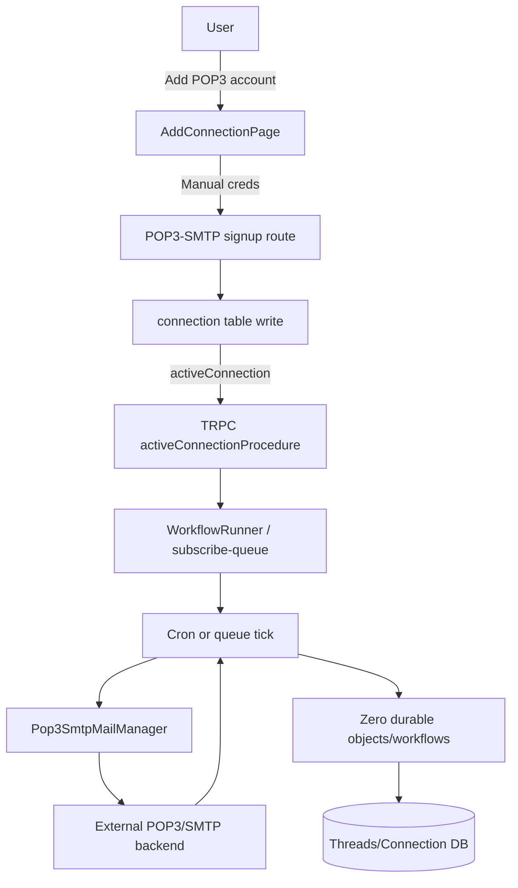

## Executive plan

Single-provider architecture in this repo is heavily Gmail/OAuth-first. We will add a dedicated POP3/SMTP path that still satisfies existing contracts (`MailManager`, TRPC, Durable Objects, workflows) but swaps push-subscription behavior for pull polling via Cloudflare queue+cron.

### Provider model and config wiring
- Extend shared provider identity in [`apps/server/src/types.ts`](apps/server/src/types.ts) and include POP3/SMTP in all provider-typed structs that currently assume only `google | microsoft`.
- Extend connection/account persistence to store POP3 credentials and endpoint settings (`pop3Host`, `pop3Port`, `pop3Secure`, `smtpHost`, `smtpPort`, `smtpSecure`) so one server can be shared across users while credentials remain per-connection.
- Keep `EProviders.pop3_smtp` provider string constant and use it consistently across DB records, queue payloads, KV keys, and workflow params.

### Driver layer
- Add new [`apps/server/src/lib/driver/pop3-smtp.ts`](apps/server/src/lib/driver/pop3-smtp.ts) that wraps the user-provided backend via `fetch`.
  - Map `list`, `get`, `create`, `searchThreads`, `syncThread`, and `listHistory` to backend endpoints.
  - Return the same normalized types used by the current drivers.
  - Include `history/marker` handling suitable for polling (e.g., backend-supplied cursor/timestamp).
- Register it in [`apps/server/src/lib/driver/index.ts`](apps/server/src/lib/driver/index.ts).
- Update [`apps/server/src/lib/server-utils.ts`](apps/server/src/lib/server-utils.ts) to pass POP3 credentials into `createDriver` and bypass OAuth token validation for this provider.

### Auth/connection lifecycle (OAuth bypass)
- Add a custom provider definition in [`apps/server/src/lib/auth-providers.ts`](apps/server/src/lib/auth-providers.ts) with `isCustom: true` and a dedicated signup/login route.
- Extend trusted provider settings in [`apps/server/src/lib/auth.ts`](apps/server/src/lib/auth.ts) and adjust `connectionHandlerHook` so POP3/SMTP can validate required credentials and build the correct driver.
- Add/adjust persistence in the server DB layer so `password` and server settings are saved during connection creation and updates.

### Replace push subscription model for POP3/SMTP with polling
- Keep Google push subscription path intact but route POP3/SMTP through queue/cron sync only.
- In [`apps/server/src/lib/utils.ts`](apps/server/src/lib/utils.ts), keep `setSubscribedState` generic and ensure POP3/SMTP cleanup keys stay aligned with key format.
- Update [`apps/server/src/lib/brain.ts`](apps/server/src/lib/brain.ts) and [`apps/server/src/trpc/routes/brain.ts`](apps/server/src/trpc/routes/brain.ts) to branch provider behavior: Google path uses subscription factory, POP3/SMTP path marks subscribed state and enqueues a poll/sync job.
- Update [`apps/server/src/main.ts`](apps/server/src/main.ts) queue handlers and cron logic:
  - For `subscribe-queue`, trigger workflow sync coordinator for POP3/SMTP without calling Gmail notification setup.
  - For periodic expiry checks, use a dedicated POP3/SMTP KV marker for last poll and schedule resync when due.
- Add `pop3_smtp_last_poll_time` in [`apps/server/src/env.ts`](apps/server/src/env.ts) and [`apps/server/wrangler.jsonc`](apps/server/wrangler.jsonc), with cron frequency matching desired polling interval.

### Workflows and Durable Objects
- Generalize Google assumptions in workflow orchestration:
  - [`apps/server/src/pipelines.ts`](apps/server/src/pipelines.ts)
  - [`apps/server/src/workflows/sync-threads-workflow.ts`](apps/server/src/workflows/sync-threads-workflow.ts)
  - [`apps/server/src/workflows/sync-threads-coordinator-workflow.ts`](apps/server/src/workflows/sync-threads-coordinator-workflow.ts)
  - [`apps/server/src/routes/agent/index.ts`](apps/server/src/routes/agent/index.ts)
- Replace hardcoded `'google'`/`EProviders.google` branches with provider-aware handling and explicit POP3/SMTP polling branches for markers/history.
- In [`apps/server/src/routes/chat.ts`](apps/server/src/routes/chat.ts) and thread persistence paths, write `providerId` from active connection instead of hardcoded `google`.

### TRPC and API-facing behavior
- Update [`apps/server/src/trpc/trpc.ts`](apps/server/src/trpc/trpc.ts) so token-refresh/error cleanup only applies to OAuth providers.
- Update list/status procedures in [`apps/server/src/trpc/routes/connections.ts`](apps/server/src/trpc/routes/connections.ts) to evaluate POP3/SMTP connection completeness with credential fields, not access/refresh tokens.
- Ensure send/list paths in [`apps/server/src/trpc/routes/mail.ts`](apps/server/src/trpc/routes/mail.ts) are provider-agnostic and still enqueue `send_email_queue` for POP3/SMTP.
- Ensure search assistant in [`apps/server/src/trpc/routes/ai/search.ts`](apps/server/src/trpc/routes/ai/search.ts) has a POP3/SMTP branch (or default generic system prompt).

### Frontend integration
- Add `pop3-smtp` entry in [`apps/mail/lib/constants.tsx`](apps/mail/lib/constants.tsx) so UI renders provider card.
- Update add/connect modal in [`apps/mail/components/connection/add.tsx`](apps/mail/components/connection/add.tsx) for manual credential form flow for custom providers.
- Add POP3/SMTP connection/reconnect route and wire in settings page logic in [`apps/mail/app/(routes)/settings/connections/page.tsx`](apps/mail/app/(routes)/settings/connections/page.tsx).
- Ensure custom provider click handling in [`apps/mail/app/(auth)/login/login-client.tsx`](apps/mail/app/(auth)/login/login-client.tsx) points to your POP3/SMTP form route.
- Update [`apps/mail/hooks/use-connections.ts`](apps/mail/hooks/use-connections.ts) status filtering to include POP3/SMTP credential completeness logic.

### Backend API contract and migration
- Define/implement a stable contract for the user-supplied POP3/SMTP server, then map one-to-one to driver methods.
- Add migration scripts and seed-safe rollout path for existing `connection.providerId` enum extension and new columns.

### End-to-end sequence

## Delivery approach
- Implement in a single branch with small, provider-separated commits to keep behavior changes auditable.
- Start with types/schema/driver/utility seams first, then auth flow, then polling + workflows, then frontend.
- Keep Gmail-only code intact unless strictly required, and add POP3/SMTP branches explicitly to avoid regressions.

## Validation scope (design-time checklist)
- Manual scenario: create POP3/SMTP connection, send email via SMTP backend, trigger poll cycle, verify inbox thread sync and UI listing.
- Regression scenario: ensure Gmail sync/notification flow still works with same paths and environment bindings.